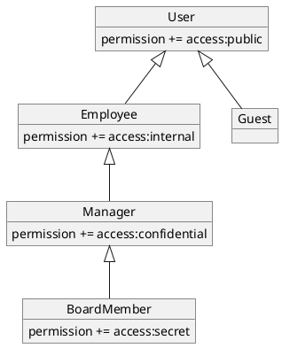

Examples for handling Roles and Permissions with OPA
---

The example demonstrates how to use OPA in hierachical RBAC scenarios.

The examples can be executed via the [Open Policy Agent playground](https://play.openpolicyagent.org).

# Data
The data for our scenario contains a role hierarchy, a mapping of roles to permissions and user role assignments.

## Role hierarchy
The role hiearchy with embedded permissions looks like this:


## Users

In this example we have the following users:

| User   | Role     |
|--------|----------|
| alice  | employee |
| bob    | manager  |
| emilia | board    |

## Raw Data

The raw data:
```json
{
    "roles": {
        "global": {
            "board": {
                "parent": "manager"
            },
            "manager": {
                "parent": "employee"
            },
            "employee": {
                "parent": "user"
            },
            "guest": {
                "parent": "user"
            },
            "user": {}
        }
    },
    "role_permissions": {
        "board": {
            "add": [
                "access:secret"
            ]
        },
        "manager": {
            "add": [
                "access:confidential"
            ]
        },
        "employee": {
            "add": [
                "access:internal"
            ]
        },
        "user": {
            "add": [
                "access:public"
            ]
        }
    },
    "user_roles": {
        "alice": [
            "employee"
        ],
        "bob": [
          "manager"
        ],
        "emilia": [
            "board"
        ]
    }
}
```

# Policy

The rego policy contains the logic to determine if a user has the required permissions to access a resource or to perform 
an operation. 

This example policy centers around the `allow` rule. If all conditions within the `allow` rule evaluate to `true` then access is granted, otherwise denied.

This policy also provides additional query possibilities, e.g.:
- Enumerate the roles for a given user
- Enumerate the permissions for a given user
- Enumerate which user have a certain permission

The Rego policy file
```rego
package app.access

default allow := false

allow {
	input.required_permission = current_user_permissions[_]
}

user_permissions[user] := perms {
	role = user_roles[user]
	perms := data.role_permissions[role].add[_]
}

current_user_permissions[perm] {
	role = current_user_roles[_]
	perm = data.role_permissions[role].add[_]
}

current_user_roles := roles {
	roles = user_roles[input.user]
}

user_roles[user] := roles {
	direct_roles = data.user_roles[user]
	role_graph[direct_role]
	roles := graph.reachable(role_graph, direct_roles)
}

role_graph[role] := edges {
	data.roles.global[role]
	edges := {neighbor | neighbor := data.roles.global[role].parent}
}

whocan[user] {
	direct_roles = data.user_roles[user]
	roles := graph.reachable(role_graph, direct_roles)
	role = roles[_]
	perm = data.role_permissions[role].add[_]
	perm = input.required_permission
}
```

# Some example queries

We can query the policy above with the following example `input` documents.

Which roles does the user `alice` have?
 > Select `current_user_roles` block and click evaluate.
```json
{
  "user": "alice"
}
```

Which permissions does the user `alice` have?
> Select `current_user_permissions` block and click evaluate.
```json
{
  "user": "alice"
}
```

Can `alice` perform the operation `access:internal`?
 > Select `allow` block and click evaluate.
```json
{
  "user": "alice",
  "required_permission": "access:internal"
}
```

Can `alice` perform the operation `access:secret`?
 > Select `allow` block and click evaluate.
```json
{
  "user": "alice",
  "required_permission": "access:secret"
}
```

Can `Emilia` perform the operation `access:secret`?
 > Select `allow` block and click evaluate.
```json
{
  "user": "emilia",
  "required_permission": "access:secret"
}
```

Who can perform the operation `access:confidential`?
 > Select `whocan` block and click evaluate.
```json
{
  "required_permission": "access:confidential"
}
```